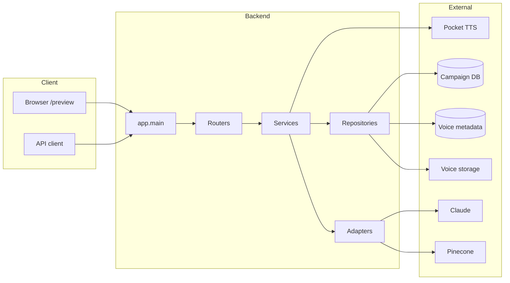

# Architecture overview

GM Voice Studio is a FastAPI backend serving a React preview UI, with TTS (Pocket TTS), voice cloning, campaign/adventure persistence, RAG, and a live Co-DM WebSocket.

## High-level flow

- **Entry:** `server.py` loads `.env`, calls `create_app()` from `app/main.py`, runs uvicorn.
- **App:** `app/main.py` registers middleware (CORS, rate limit, request logging with `X-Request-ID`), mounts static files, runs `init_db()` (Alembic for campaign DB), then includes routers.
- **Routers:** Health/config in `app/api/routers/`; legacy routes (voices, TTS, jobs, campaigns, adventure, RAG, brain, live WebSocket) in `app/api/routers/routes_legacy.py`.
- **Domains:** `app/domain/` groups voice, campaign, live, ai; see [current-architecture.md](current-architecture.md) for ownership.
- **Infrastructure:** Adapters (LLM, Retriever, Indexer, Transcription, VoiceStorage) in `app/infrastructure/adapters/`; DB and TTS in `app/infrastructure/` and `app/services/`.

## Key docs

| Doc | Purpose |
|-----|---------|
| [current-architecture.md](current-architecture.md) | Detailed layout, startup, endpoints, domain boundaries, adapters, LLM split, frontend, packaging, testing. |
| [api.md](api.md) | API endpoint summary and link to OpenAPI. |
| [deployment.md](deployment.md) | Production hardening, env, migrations, optional Redis. |
| [frontend.md](frontend.md) | React build, dev server, API client. |
| [testing.md](testing.md) | Test layout, markers, smoke validation. |
| [contributing.md](contributing.md) | Where to add routers, services, adapters, migrations, tests. |
