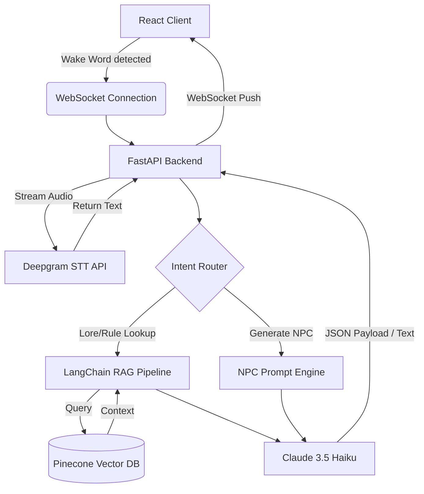

# Co-DM Live Voice Assistant — Implementation Plan

## Overview
Low-latency, voice-activated tabletop RPG assistant for Game Masters.
Listens for a wake word, streams audio for transcription, queries a
vector DB for campaign lore/mechanics, and returns text + UI widgets.

Existing backend: GM Voice Studio (KaniTTS) — provides voice generation.
New layers: React client, WebSocket pipeline, Deepgram STT, LangChain RAG, Claude LLM.

---

## System Architecture

---

## Tech Stack
- **Frontend:** React (Vite), TailwindCSS
- **Backend:** Python, FastAPI, WebSockets (extends existing `server.py`)
- **Audio:** Picovoice Porcupine (local wake word), Deepgram (streaming STT)
- **AI/Data:** LangChain, Claude 3.5 Haiku (`claude-haiku-4-5`), Pinecone
- **Voice Output:** GM Voice Studio / KaniTTS (existing)

---

## Sprint 1 — Foundation: Audio & Communication Pipeline
**Objective:** Real-time wake-word → audio stream → live transcription loop.

### Tasks
- [ ] Scaffold React + Vite frontend (`co-dm-client/`)
- [ ] Install and configure TailwindCSS
- [ ] Add Picovoice Porcupine SDK; register wake word "Hey Co-GM"
- [ ] On wake word: open WebSocket to FastAPI backend, stream raw PCM audio
- [ ] Add `/ws/audio` WebSocket endpoint to FastAPI backend
- [ ] Integrate Deepgram streaming SDK; route incoming audio stream to Deepgram
- [ ] Push live transcription text back to React client via WebSocket
- [ ] Display transcriptions in a scrollable "Action Log" UI panel
- [ ] End-to-end smoke test: speak → see text appear in browser

### Acceptance Criteria
- Wake word triggers mic capture (no button required)
- Live words appear in the Action Log within ~500 ms of speaking
- Silence / wake word not detected → mic capture stops

---

## Sprint 2 — Knowledge Base: RAG Setup
**Objective:** Ingest campaign documents and enable semantic search.

### Tasks
- [ ] Create Pinecone index (`co-dm-index`) with `text-embedding-3-small` dimensions (1536)
- [ ] Write `ingest.py` — loads PDFs via LangChain, chunks text, upserts embeddings to Pinecone
- [ ] Support ingesting: rulebooks, faction notes, bestiaries, session notes (PDF + plain text)
- [ ] Add metadata to each chunk: `{source, page, doc_type}` for filtering
- [ ] Write `retrieval.py` — `retrieve(query: str, top_k=5)` → list of text chunks
- [ ] Add FastAPI endpoint `POST /rag/query` → returns top-k chunks as JSON
- [ ] Test with sample 1930s noir fantasy rulebook PDF; verify relevant chunks returned

### Acceptance Criteria
- `ingest.py` processes a PDF and upserts chunks without errors
- `retrieve("What are the rules for grappling?")` returns relevant text
- `/rag/query` endpoint responds in < 2 s for typical queries

---

## Sprint 3 — The Brain: LLM Orchestration
**Objective:** Transcription → intent classification → RAG + LLM → structured response.

### Tasks
- [ ] Implement `IntentRouter` class — classify transcription into: `general_chat`, `rule_lookup`, `npc_request`
- [ ] Wire RAG: for `rule_lookup`, call `retrieve()` → pass chunks as context to LLM
- [ ] LLM call: use `claude-haiku-4-5` via Anthropic SDK; system prompt sets Co-DM persona
- [ ] Format LLM output as structured JSON: `{"type": "stat_block"|"lore"|"chat", "content": "..."}`
- [ ] Push JSON payload to React client over existing WebSocket connection
- [ ] React: parse JSON, render type-specific pop-up widgets (dark-mode, ephemeral, dismissible)
  - `stat_block` → monster/NPC stats card
  - `lore` → scrollable text panel
  - `chat` → inline Action Log entry
- [ ] Add 10 s timeout + fallback message if LLM/RAG is slow

### Acceptance Criteria
- "What's the AC of a Speakeasy Enforcer?" → stat_block widget appears
- "Tell me about the Silver Court Mages." → lore widget appears
- General question → inline Action Log response
- No crash on empty transcription or API timeout

---

## Sprint 4 — NPC Generator
**Objective:** On-demand deep NPC profile generation, bypassing RAG.

### Tasks
- [ ] Add WebSocket message type `{type: "npc_request", genre, location, name, role}`
- [ ] Add `POST /npc/generate` FastAPI endpoint (also triggerable from WebSocket)
- [ ] Implement NPC prompt engine with strict system prompt:

  > You are a masterful character development assistant for TTRPGs.
  > Given: [GENRE], [LOCATION], [Character Name or Type], [Role in story].
  > Output a full character profile with headers:
  > - Basic Information & Stats (AC, HP, Attacks)
  > - Physical Appearance (vivid, sensory details)
  > - Personality Traits & Quirks
  > - Motivations & Driving Forces
  > - Secrets / Plot Hooks
  > Format for quick reading behind a DM screen.

- [ ] Stream LLM response tokens back to client for progressive display
- [ ] React: render NPC card with collapsible sections per header
- [ ] Wire to GM Voice Studio: optional "Speak as NPC" button uses cloned/preset voice

### Acceptance Criteria
- NPC card generated in < 15 s with all required sections
- Streaming tokens appear progressively in the UI
- "Speak as NPC" routes text to KaniTTS and plays audio

---

## Task Management

### Active Tasks
See Sprint 1 tasks above — begin here.

### Lessons Log
*(Update immediately after any correction or failed approach)*

| Date | Mistake | Rule to prevent recurrence |
|------|---------|---------------------------|
| —    | —       | —                         |

---

## Verification Checklist
- [ ] `npm run dev` in `co-dm-client/` loads UI without errors
- [ ] Wake word triggers mic capture in browser
- [ ] Transcription appears in Action Log within 500 ms
- [ ] `python ingest.py --file rulebook.pdf` runs without error
- [ ] `curl -X POST /rag/query -d '{"query":"grappling rules"}'` returns chunks
- [ ] Full pipeline: speak rule question → stat block widget appears in UI
- [ ] NPC generation: trigger → streaming card with all 5 sections
- [ ] KaniTTS integration: "Speak as NPC" plays audio
